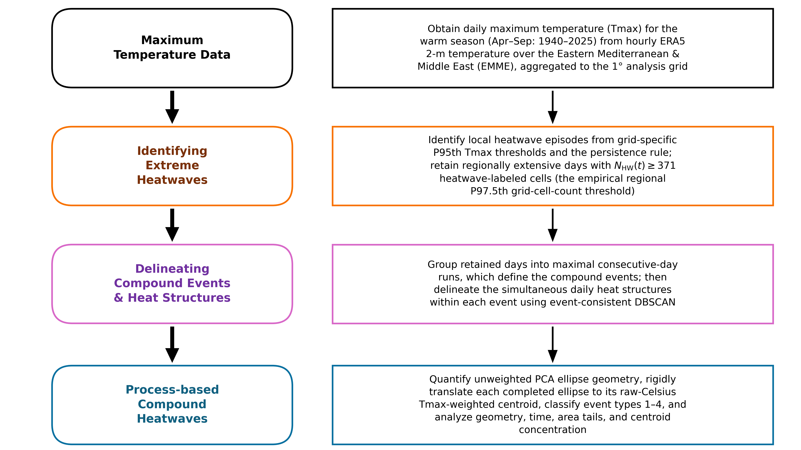
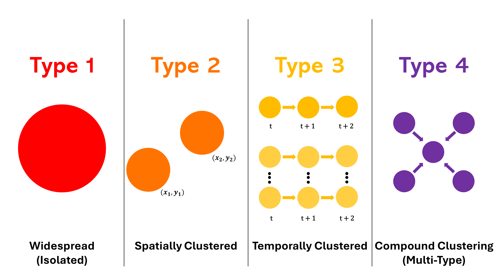

# SCORCH

**Spatiotemporal Classification of Regional Compound Heatwaves**

SCORCH is a reproducible framework for identifying, characterizing, and
classifying regionally extensive compound heatwaves over the Eastern
Mediterranean and Middle East. From ERA5-derived daily maximum temperature
it detects local heatwave episodes, selects the days on which heat is
regionally extensive, groups consecutive such days into compound events,
resolves the daily spatial heat structures within them, summarizes each
structure's geometry with a PCA ellipse, and assigns every event to one of
four types defined by duration and daily structural multiplicity.

[](LICENSE)

## Persistent resources

| Resource | Identifier | Status |
|---|---|---|
| Source repository | https://github.com/fawazbouhamad/SCORCH | Public |
| Processed-data archive | [10.5281/zenodo.21717752](https://doi.org/10.5281/zenodo.21717752) | **Reserved DOI; record forthcoming** |
| Software archive | [10.5281/zenodo.21717874](https://doi.org/10.5281/zenodo.21717874) | **Reserved DOI; record forthcoming** |
| Associated manuscript | Understanding the Spatiotemporal Organization of Regionally Extensive Heatwaves Using the SCORCH Framework | Prepared for submission |
| Authors | Fawaz Bouhamad and Nasser Najibi | — |

> Both Zenodo DOIs are **reserved and not yet resolvable**. The records are
> unpublished drafts; they are not openly available yet, and the DOIs will
> begin to resolve when the records are published. Archive badges will be
> added at that point, not before.

**Documentation:** [Reproducibility](docs/REPRODUCIBILITY_REPORT.md) ·
[Provider reconstruction](docs/PROVIDER_RECONSTRUCTION_GUIDE.md) ·
[Figure provenance](docs/FIGURE_PROVENANCE.csv) ·
[Reproducibility matrix](docs/REPRODUCIBILITY_MATRIX.csv) ·
[Licences and attribution](docs/LICENSES_AND_ATTRIBUTION.md) ·
[Terminology](docs/TERMINOLOGY.md)

## Scientific overview

The analysis domain is a 1° grid over the Eastern Mediterranean and Middle
East (10–46 °N, 20–70 °E), restricted to the April–September warm season for
1940–2025. This yields **1,800 valid grid boxes** across **15,738**
warm-season days.

A local heatwave episode is a run of at least three consecutive days on
which a grid box exceeds its own calendar-day 95th-percentile threshold. The
count of grid boxes in local heatwave on a given day, *N*<sub>HW</sub>(*t*),
measures how regionally extensive the heat is. Days satisfying
*N*<sub>HW</sub>(*t*) ≥ **371** — the regional 97.5th-percentile threshold of
that count — are retained as regionally extensive days; there are **395** of
them. Maximal runs of consecutive retained days define **51 compound
events**.

Within each retained day, DBSCAN groups the exceeding boxes into spatially
coherent daily heat structures, giving **760** structures overall. Each
structure's geometry is summarized by a PCA ellipse at a fixed σ = 1.25.
Events are then classified by duration and daily structural multiplicity
into four types, with **3, 4, 20 and 24** events in Types 1–4 respectively.

Two conventions are worth stating explicitly, because they are easy to
assume otherwise:

- **PCA geometry is computed without temperature weighting.** Once the
  ellipse is complete it is rigidly translated to the structure's
  Tmax-weighted centroid, computed in raw degrees Celsius within that
  structure. The translation moves the ellipse's location only; it does not
  alter clustering, PCA axes, orientation, area, shape ratio, typology, σ
  selection, Appendix A, or the upper-tail results.
- **SCORCH does not track structures across days.** It characterizes each
  day's structures independently. It therefore makes no claim about
  structure identity, continuity, splitting, or merging over time.

SCORCH also fits a log-Gaussian Cox process to the structure centroids to
summarize their relative spatial concentration. That surface is a relative
concentration summary — not a probability, risk, hazard, susceptibility, or
impact estimate, and not a forecast.

## Analysis workflow

<p align="center">
  
</p>

<p align="center"><em>SCORCH analysis workflow. Local heatwave episodes are
identified, regionally extensive days are selected, and maximal
consecutive-day runs define compound events before daily spatial clustering
and geometric analysis.</em></p>

## What SCORCH does

- Detects local heatwave episodes against per-box, per-calendar-day
  percentile thresholds.
- Selects regionally extensive days by the regional
  *N*<sub>HW</sub>(*t*) ≥ 371 criterion and builds compound events from
  maximal consecutive runs.
- Resolves daily heat structures with DBSCAN over the exceeding boxes.
- Summarizes each structure with a fixed-σ PCA ellipse (orientation, axes,
  area, shape ratio) translated to its Tmax-weighted centroid.
- Classifies each event into Types 1–4 by duration and daily multiplicity.
- Summarizes centroid concentration with a log-Gaussian Cox process, and
  reports upper-tail and trend diagnostics.
- Regenerates every deposit-reproducible figure and table, with byte-level
  provenance for each output.

## Event typology

<p align="center">
  
</p>

<p align="center"><em>SCORCH compound-heatwave typology based on duration
and daily structural multiplicity. The diagram summarizes daily
configurations and does not represent tracked structure identities,
splitting, or merging.</em></p>

## Quick reproduction

Python orchestrates the whole workflow. The log-Gaussian Cox process stage
additionally invokes R with `spatstat` through an external `Rscript` call;
that stage is documented in [docs/R_WORKFLOW.md](docs/R_WORKFLOW.md).

The fast route begins from the **processed Zenodo data**, not from raw
provider files. Retrieval of raw ERA5 fields from the Copernicus Climate
Data Store and the hourly-to-daily preprocessing are documented separately
in [docs/PROVIDER_RECONSTRUCTION_GUIDE.md](docs/PROVIDER_RECONSTRUCTION_GUIDE.md);
that provider-level route is **not fully automated** and is not executed by
the commands below.

```bash
# 1. install
pip install -e .[figures]

# 2. fetch and verify the processed-data deposit
#    (needs the deposit identifier; see the guide above while the
#     Zenodo record remains an unpublished draft)
python -m scorch.cli fetch-data --dest scorch_data
python -m scorch.cli validate-deposit --dir scorch_data

# 3. run the full fast route (canonical bootstrap NBOOT=5000)
python run_reproduction.py fast \
    --data-dir scorch_data \
    --out-dir reproduced \
    --pub-dir publication_outputs \
    --nboot 5000

# 4. unit and regression tests
python -m pytest tests -q
```

Useful variants:

```bash
python run_reproduction.py smoke   # catalog validation + Table 1 + Figs 12 and 2
python run_reproduction.py guide   # print the provider reconstruction guide only
```

`--nboot` defaults to the canonical 5000. Any smaller value produces a
quick, **non-canonical** run whose power-law numbers are not the
manuscript-reported values.

## Expected validation results

| Check | Expected |
|---|---|
| Fast route | **33/33 stages PASS**, including the publication-outputs assembly |
| Reconstruction route | 9/9 stages, weighted-centroid stage executing 760/760 |
| Test suite | 287 passed, 0 failed, 0 errors |
| Valid grid boxes | 1,800 |
| Warm-season days | 15,738 |
| Regional threshold | *N*<sub>HW</sub>(*t*) ≥ 371 |
| Regionally extensive days | 395 |
| Compound events | 51 |
| Daily heat structures / ellipses | 760 |
| Events in Types 1–4 | 3 / 4 / 20 / 24 |

Some guards skip unless their fixtures are present; set `SCORCH_DATA_DIR` to
the deposit root so that every scientific and publication guard runs.

## Repository organization

| Path | Contents |
|---|---|
| `src/scorch/` | The installable package: pipeline stages, catalog, CLI |
| `scripts/` | Figure, publication, deposit, LGCP and validation scripts |
| `configs/` | The complete, closed reproduction configuration |
| `tests/` | Unit, regression, provenance and manuscript-integrity tests |
| `docs/` | Provenance, reproducibility, licensing and terminology records |
| `assets/` | Frozen figure assets and canonical manuscript figure rasters |
| `data/auxiliary/` | Small author-generated inputs shipped with the code |
| `environment/` | Hash-pinned environment locks |
| `remediation/` | Evidence packet for the v1.0.1 correction round |
| `run_reproduction.py` | Cross-platform driver for the stage table |

Per-figure provenance is machine-readable rather than narrated here: see
[docs/FIGURE_PROVENANCE.csv](docs/FIGURE_PROVENANCE.csv),
[docs/MANUSCRIPT_FIGURE_IDENTITY.csv](docs/MANUSCRIPT_FIGURE_IDENTITY.csv)
and [docs/REPRODUCIBILITY_MATRIX.csv](docs/REPRODUCIBILITY_MATRIX.csv).

## Data and software availability

The processed dataset and reproduction inputs are associated with the
reserved Zenodo data DOI
[10.5281/zenodo.21717752](https://doi.org/10.5281/zenodo.21717752). The
source code and reproducibility workflow are maintained in this repository,
and the corresponding software archive has the reserved Zenodo DOI
[10.5281/zenodo.21717874](https://doi.org/10.5281/zenodo.21717874). Both
Zenodo records will become publicly accessible when they are published.

SCORCH redistributes no raw provider data. ERA5-derived content carries the
Copernicus/ECMWF terms and required notice, and GHCN-Daily-derived content
the NOAA/NCEI source and use terms; both are set out in
[docs/LICENSES_AND_ATTRIBUTION.md](docs/LICENSES_AND_ATTRIBUTION.md).

## Citation

Cite the software using the metadata in [`CITATION.cff`](CITATION.cff) —
GitHub renders it under **Cite this repository**.

The associated manuscript is:

> Bouhamad, F., and Najibi, N. Understanding the Spatiotemporal Organization
> of Regionally Extensive Heatwaves Using the SCORCH Framework. Manuscript
> prepared for submission to *Weather and Climate Extremes*.

It has no DOI, volume, issue, page range or publication date yet, so it is
deliberately not declared as a machine-readable `preferred-citation`; that
will be added once the article is published.

If you use SCORCH, please cite the associated software archive and
manuscript. If you use the deposited data, please also cite the data
archive. Citation is requested as a matter of scholarly practice and is not
an additional condition of the GPL.

## FAIR

- **Findable** — persistent DOIs are reserved for both the software and the
  processed data, and the repository carries `CITATION.cff` and
  `.zenodo.json` metadata.
- **Accessible** — the source is public; the processed data will be openly
  downloadable from Zenodo on publication, and the deposit ships its own
  manifest and validator.
- **Interoperable** — outputs are CSV, NetCDF, PNG and PDF, with a data
  dictionary and an explicit, closed configuration schema.
- **Reusable** — path-specific licensing, a hash-pinned environment lock,
  byte-level figure provenance, and a 33-stage reproduction route.

The CARE Principles for Indigenous Data Governance are **not** invoked: this
work uses global reanalysis and public station records and involves no
Indigenous or community-governed data, so claiming CARE alignment would be
inaccurate.

## License and attribution

SCORCH source code is licensed under the GNU General Public License v3.0
only (GPL-3.0-only). Data, figures, documentation, and third-party material
may have separate path-specific terms described in
[docs/LICENSES_AND_ATTRIBUTION.md](docs/LICENSES_AND_ATTRIBUTION.md).

Earlier public revisions of this repository were released under the MIT
License and remain under the licence included with those revisions; see
[docs/LICENSING_HISTORY.md](docs/LICENSING_HISTORY.md).

Contains modified Copernicus Climate Change Service information [1940–2025];
neither the European Commission nor ECMWF is responsible for any use of the
Copernicus information.

## Issues and contact

Please open an issue on the
[issue tracker](https://github.com/fawazbouhamad/SCORCH/issues). Contributor
guidance is in [CONTRIBUTING.md](CONTRIBUTING.md).
